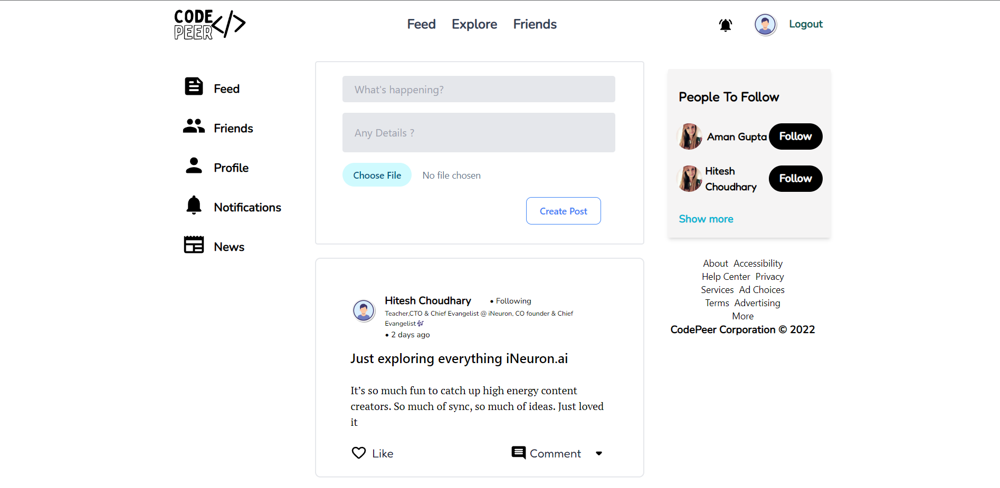
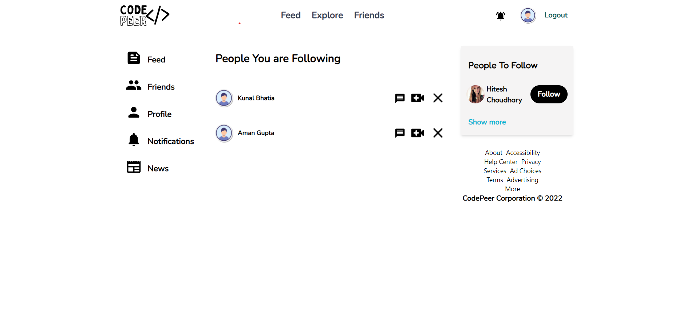
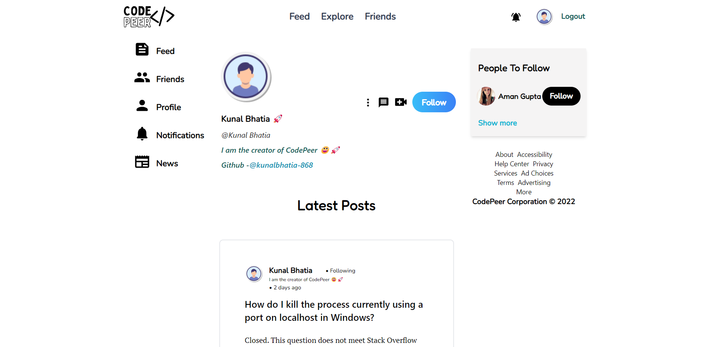

# <strong><em>CodePeer</em></strong>


## Overview
- A social networking platform for developers to engage and share their questions and experiences.
- API development is done using Django REST framework and data storage is done using PostgreSQL.
- Developed the frontend of the web application using React and Tailwind CSS was used for styling.

<br>
<br>




# Backend-Setup 

clone the repositroy:-
```
git clone https://github.com/kunalbhatia-868/CodePeer 
```
Create Virtual env for django-part:-
```
cd backend
virtualenv venv
```
Activate Virtual env:-
```
venv/bin/activate
```
Install Dependencies:-
```
pip install -r requirements.txt
```
Make Migrations:-
```
python manage.py makemigrations
python manage.py migrate
```
Start server for your REST-API:-
```
python manage.py runserver
```
# Frontend Setup:-
Go to root and Open another terminal window
```
cd frontend
```
Install Dependencies:-
```
npm install
```
Run Server:-
```
npm run dev
```


